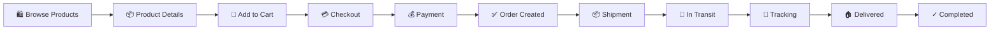
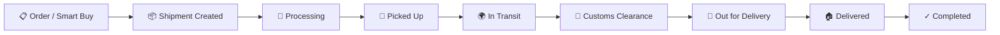

# Baobab Atlas

> **Shop the World. We Bring It Closer.**

Baobab Atlas is a modern **e-commerce marketplace and Smart Buy platform** that connects customers with products from local and international markets.

Customers can either purchase available products directly through the marketplace or use **Smart Buy** to request products that are difficult to find. The platform manages the complete journey from request or purchase to payment, shipment, tracking, and delivery.

---

## ✨ Core Modules

| Module                 | Description                                                     |
| ---------------------- | --------------------------------------------------------------- |
| 🛒 **E-commerce**      | Product discovery, cart, checkout, payment, orders and delivery |
| 🌎 **Smart Buy**       | Product requests, quotations, purchase, payment and shipment    |
| 📦 **Shipments**       | Shipment creation, carriers, tracking and delivery status       |
| 👤 **Customer Portal** | Orders, Smart Buy requests, payments and tracking               |
| ⚙️ **Admin Panel**     | Centralized platform and business management                    |
| 📊 **Reports**         | E-commerce and Smart Buy performance reports                    |

---

## 🛒 E-commerce Flow



### E-commerce Management

```text
Categories → Products → Cart → Checkout → Orders
                                      ↓
                              Payment → Shipment
                                      ↓
                               Tracking → Delivery
```

---

## 🌎 Smart Buy Flow

```mermaid
flowchart LR
    A[👤 Customer] --> B[🌎 Start Smart Buy]
    B --> C[📝 Create Request]
    C --> D[📨 Request Submitted]
    D --> E[🔍 Admin Review]
    E --> F[💬 Prepare Quote]
    F --> G[📩 Quote Sent]
    G --> H[👤 Customer Accepts]
    H --> I[💳 Payment]
    I --> J[🛒 Product Purchase]
    J --> K[📦 Shipment]
    K --> L[🚚 In Transit]
    L --> M[📍 Tracking]
    M --> N[🏠 Delivered]
    N --> O[✓ Completed]
```



### Smart Buy Request Lifecycle

```text
Create Request
      ↓
Submitted
      ↓
Admin Review
      ↓
Quote
      ↓
Customer Accept / Reject
      ↓
Payment
      ↓
Purchase
      ↓
Shipment
      ↓
Tracking
      ↓
Delivered
      ↓
Completed
```

---

## 📦 Shipment Flow

Both **E-commerce Orders** and **Smart Buy Requests** can create shipments.



> Shipment stages may vary depending on the shipment type and service.

---

## 👤 Customer Portal

```text
Dashboard
│
├── 🛒 E-commerce
│   ├── Shop
│   ├── Cart
│   ├── Checkout
│   ├── Payments
│   ├── My Orders
│   └── Shipment & Tracking
│
├── 🌎 Smart Buy
│   ├── My Requests
│   ├── Start Smart Buy
│   ├── Request Details
│   ├── Quote
│   ├── Payment
│   └── Shipment & Tracking
│
└── 👤 Account
    ├── Profile
    ├── Payments
    └── Notifications
```

---

## ⚙️ Admin Panel

```text
Dashboard
│
├── 👥 User Management
│   ├── Users
│   ├── Roles
│   └── Permissions
│
├── 🛒 E-commerce
│   ├── Products
│   ├── Categories
│   ├── Orders
│   ├── Payments
│   └── Shipments
│
├── 🌎 Smart Buy
│   ├── Requests
│   ├── Quotes
│   ├── Purchases
│   ├── Payments
│   └── Shipments
│
├── 💳 Payments
│   ├── E-commerce Payments
│   └── Smart Buy Payments
│
├── 📊 Reports
│   ├── E-commerce Reports
│   └── Smart Buy Reports
│
└── ⚙️ Settings
```

---

## 🧩 Development Roadmap

### 🌎 Smart Buy

```mermaid
flowchart LR
    A[01 Structure] --> B[02 Database]
    B --> C[03 Migrations]
    C --> D[04 Models]
    D --> E[05 Client Request]
    E --> F[06 Request Management]
    F --> G[07 Admin Management]
    G --> H[08 Quote System]
    H --> I[09 Quote Accept / Reject]
    I --> J[10 Payments]
    J --> K[11 Shipment]
    K --> L[12 Tracking]
    L --> M[13 Workflow & Validation]
    M --> N[14 Testing]
```



### 🛒 E-commerce

```mermaid
flowchart LR
    A[01 Database] --> B[02 Categories]
    B --> C[03 Products]
    C --> D[04 Product Images]
    D --> E[05 Listing]
    E --> F[06 Product Details]
    F --> G[07 Cart]
    G --> H[08 Checkout]
    H --> I[09 Orders]
    I --> J[10 Payment]
    J --> K[11 Shipment]
    K --> L[12 Tracking]
    L --> M[13 Reports]
```



---

## 🛠️ Technology Stack

**Backend**

* Laravel
* PHP
* MySQL

**Frontend**

* Laravel Blade
* HTML5
* SCSS
* JavaScript
* jQuery

**Libraries & UI**

* Bootstrap
* DataTables
* Remix Icon
* Font Awesome
* Swiper
* AOS
* Fancybox
* SweetAlert2

---

## 🎯 Project Goals

Baobab Atlas brings **shopping, product sourcing, payment, shipment, and tracking** into one connected platform.

### For Customers

* 🛍️ Discover and purchase products
* 🌎 Request unavailable products through Smart Buy
* 💬 Receive customized quotations
* 💳 Make payments
* 📦 Track orders and shipments
* 🔔 Manage notifications and account activity

### For Administrators

* 👥 Manage users and permissions
* 🛒 Manage products, categories and orders
* 🌎 Manage Smart Buy requests and quotations
* 💳 Manage payments
* 📦 Manage shipments and tracking
* 📊 Monitor business reports

---

## 🚀 Future Expansion

The platform is designed to support future services and features such as:

* 🏭 Warehousing
* 🚚 Distribution
* 🌍 Additional shipping carriers
* 💳 More payment methods
* 📍 Advanced shipment tracking
* 🔔 Customer notifications
* 📊 Advanced analytics
* 🛍️ Expanded marketplace features

---

## 📌 Core Concept

> **If you can find it, buy it. If you can't find it, request it through Smart Buy.**

---

## 📄 License

This project is proprietary software. Unauthorized copying, distribution, modification, or commercial use is not permitted without explicit permission from the project owner.
